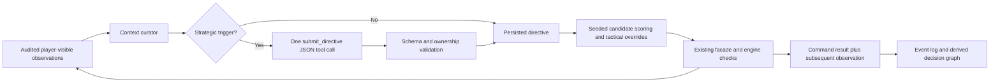

# Strategic directives, scouting, and the next planning layer

Status: implementation and next-step contract, 2026-09-05. The controller landed
in `8cc5f31`, the scouting foundation in `e72a6e6`, and the provider-facing
directive schema correction in `4b4da3f`. Curator and driver integration landed
in `a44907c`; the full release and live gates remain separate. This document does
not establish a completed live 60-round match, calibrated forecasts, or improved
strategic strength.

The user-facing division of work is explicit: the model adjusts strategy and
issues specific tactical overrides through a JSON tool call. The system gathers
observations and executes routine orders without a model request for each read,
unit move, or quiet turn. Existing provider settings, request limits, turn
deadlines, and the documented movement-drift allowance remain separate controls.



## Implemented contract

[`StrategicController`](../src/civ_arena/agents/llm/strategic_controller.py) is an
opt-in controller, selected by `decision_mode: strategic_autopilot`. On a
decision turn it requests exactly one `submit_directive` tool call using named
tool selection. A complete, valid directive can be accompanied by text or
thinking blocks; those blocks never supply actions. Missing, multiple, malformed
or truncated directives permit one fresh format-repair request within the
existing tool-round and match-request limits. Repeated failure aborts before any
game action. Ordinary game-action tools and basic observation tools are not
exposed to this model call. The existing client still owns transport retries and
records actual posts; one decision request must not be confused with one network
attempt. MiniMax documents support for `tool_choice`; the named-tool JSON shape
follows the compatible Messages API.
[MiniMax compatibility](https://platform.minimax.io/docs/api-reference/text-anthropic-api),
[named-tool selection](https://platform.claude.com/docs/en/agents-and-tools/tool-use/define-tools).

Each decision attempt retains its exact bounded, player-visible context and a
digest. Response diagnostics retain shape, usage and categorical validation
outcome, without raw prose or thinking. These records distinguish a formatting
failure from transport failure and bind a later reproduction to the actual
curated input. The earlier failed turn-sixteen run predates these diagnostics
and cannot be retroactively reconstructed from its compact observation events.

The initial turn requires a decision. The default cadence is five turns since
the previous decision. Additional triggers include changed owned cities, newly
visible contacts, a new settler, changed research, a lost or damaged owned unit,
and an explicit tactical request. A quiet turn reuses the directive and makes
zero provider requests. A visible contact alone does not prove war or hostile
intent. Routine scouting conservatively treats foreign contacts as possible
threats; attacks require an explicit observed-target override.

The [`directive schema and validator`](../src/civ_arena/agents/strategy_directive.py)
accept this example:

```json
{
  "version": 1,
  "scouting": {
    "policy": "cautious",
    "selection": "seeded",
    "temperature": 0.5,
    "unit_types": ["SCOUT", "WARRIOR"],
    "weights": {"unexplored": 4, "distance": 0.25, "threat": 5, "terrain": 1}
  },
  "research_preferences": ["MINING", "POTTERY"],
  "production_preferences": ["SCOUT", "MONUMENT"],
  "tactical_overrides": []
}
```

Unknown fields, non-finite or out-of-range numbers, duplicate entries, and
foreign or nonexistent override actors are rejected. Ownership comes from the
current projected roster, not arithmetic decoding of an entity ID. Each override
has exactly the arguments for its action: `hold` and `found_city` take a unit ID;
`move` also takes one canonical axial destination; `attack` also takes one target
unit ID. The provider schema has four closed `oneOf` cases matching these shapes.
Move overrides are limited to known adjacent tiles. Attack targets must be
currently observed foreign units. All overrides expire after their issuing turn,
including rejected orders; preferences persist.

[`ContextCurator`](../src/civ_arena/agents/llm/context_curator.py) uses the same
audited facade as agents. Live visibility depends on the map cache, so movement,
combat, settlement, and purchases invalidate the map before the next projected
unit and city reads. A read failure is an error, not an empty world. Context
retains complete owned entities and nearby known terrain, counts omissions, and
fails explicitly if required state cannot fit the configured character budget.

[`Scouting`](../src/civ_arena/agents/scouting.py) considers six adjacent axial
coordinates per eligible owned unit. It scores known land candidates using
potential unseen-terrain gain, distance to a known frontier, visible foreign-unit
proximity, and a declared terrain penalty. Unsupported terrain, observed occupied
tiles, observed foreign territory, and policy-specific threat proximity exclude
candidates. These are conservative heuristics, not an engine pathfinding or
legality API. An absent tile may be unseen or outside the map; its absence cannot
establish passability. `best` chooses the maximum score with a stable tie break;
`seeded` samples normalized exponential score weights.

Execution is limited to 16 opening-roster units and two distinct candidate
attempts per unit. An accepted submission is never retried in this pass. One
alternative is permitted only after an explicit movement rejection and a fresh,
unchanged observation with positive remaining movement. Refrozen zero movement,
changed state, uncertain acceptance, or a transport error ends that retry path.
The facade's adapter owns restore/refreeze; the planner never refills allowances.
Settlers default to a safe standing order; founding requires an explicit override
and the engine's site check. Unsupported scouting unit types receive standing
orders. Newly created units wait for a later pass rather than expanding its bound.

The live opening freeze needs an explicit exception: a trusted coordinator may
identify the owned, untouched phase-opening roster. Those units may receive one
initial attempt despite observed zero movement. The audit labels their available
allowance **unobserved** and preserves the actual zero reading. Observed zero by
itself never grants this exception. Simulator execution defaults to no exception.

The controller fills idle research and production from actual available options,
using preference order and a deterministic fallback. It preserves ongoing work.
Strategic mode defers the driver's competing production/research defaults,
while retaining civic and policy housekeeping. The existing bounded
`end_turn` completeness repair remains responsible for closing the lease.

## Reproduction and evidence

The planner records the configured seed, match ID, agent ID, player ID, turn,
normalized directive hash, and each unit's derived seed. The seed derivation is
`SHA256(JSON(["frontier-v1", identity, unit_id, directive_sha256]))` with sorted
keys and compact separators. Reproduction also requires the same projected
snapshot, policy implementation, and Python RNG behavior. Changing a match ID
changes the draw; using the same map seed alone does not reproduce a trajectory.

The graph records candidate exclusions, score components, selection weights,
selected action and reason, explicit overrides, and observations before and after
each attempted action. Actual facade calls and results in the event log remain
the execution authority. A raw live move receipt can contain the old position in
engine coordinates. The graph therefore uses the subsequent projected axial
`coord`; an accepted request with unchanged observation is recorded as such.
Observed change does not prove the requested destination was reached or that the
change was strategically useful.

Selection probabilities express how this heuristic chooses among candidates.
They are neither calibrated success probabilities nor confidence that a tile is
safe, legal, or empty. Existing
[`planner/uncertainty.py`](../src/civ_arena/planner/uncertainty.py) separately has
declared staleness weights for older foreign observations; those weights are also
not a measured probability model. Keep both distinct from future forecast
uncertainty.

The new directive/scouting tests passed **82 cases** after the schema correction
(`/tmp/civ-strategy-schema-pytest-final.log`); focused Ruff passed in
`/tmp/civ-strategy-schema-ruff-final.log`. These cover deterministic selection,
ownership, strict directive shapes, threat avoidance, subsequent observations,
bounded retries, and the real adapter's mocked-wire rejection/refreeze path.
They are local behavioral evidence, not provider, desktop, or live-match proof.
Integration preserves canonical event-prefix hashing: the event ledger's hash
contract rejects floating-point values, so
[`strategy_audit_event`](../src/civ_arena/agents/runtime.py) retains the numeric
graph/directive payload in the explicitly named `strategy_payload_json` string.
Identity and audit kind remain ordinary event fields. Consumers decode this JSON
field to recover scores, probabilities, directives, and reproduction inputs.
The integration includes a real ledger/hash regression; the canonical state
contract is unchanged.

Version 1 is **fresh-only**. Directive and trigger state are held per runtime;
checkpoints do not yet restore them. Resume, skipped initial turns, and reuse
after a failed controller turn are refused. An audit graph is not a checkpoint.

## Next concrete milestones

The [installed-source survey and first extraction slice](dependency-catalog-next-step.md)
binds actual source files, hashes and unresolved prerequisite semantics. It is
an implementation-ready next step, not an effective-ruleset export or forecast.

The existing [event-derived graph](../src/civ_arena/graph/projection.py) stores
claims, observations, references, and outcomes. The existing
[option planner](../src/civ_arena/planner/search.py) performs short searches in
the reduced simulator. Neither is a full Civ VI dependency graph or a validated
live economic forecasting model. Reuse their provenance and deterministic
artifact patterns while adding the missing contracts explicitly.

| Milestone | Concrete work | Acceptance probe |
|---|---|---|
| S0: settle the execution boundary | Finish curator, canonical-safe audit, and strategic driver integration. Keep one tuner client, provider caps, watchdog policy, and honest terminal records. | Real-facade tests show zero provider posts on quiet turns, preferred idle production survives housekeeping, a rejected action refreezes, and emitted graphs pass log-prefix hashing. Then separately validate fresh live play and completed seat counts. |
| S1: rules dependency graph | Build a read-only, versioned catalog of technologies, civics, buildings, units, and their prerequisite groups from the selected installed ruleset. Record game/ruleset/mod digest and source table/row provenance. Separate mandatory requirements, alternatives, unlocks, and exclusions. | Fixed fixtures include an AND prerequisite, an OR alternative, an unlock, an unresolved reference, and a cycle. Wrong/missing ruleset data fails explicitly; repeated extraction gives the same artifact. Cross-check selected entries against installed data before using them for decisions. |
| S2: player-specific feasibility graph | Join static rules to audited own technologies, civics, resources, cities, queues, and supported actions. Mark unknown facts and unavailable action capabilities explicitly. Add observation/action APIs for missing civic or district choices before proposing them. | An unlocked unit with a missing local requirement is not declared currently buildable. Foreign hidden state never enters the graph. Execution revalidates via actual available options and engine checks; graph reachability alone cannot authorize an action. |
| S3: bounded economic forecast | Start with one owned city's current production and research over horizons of one, three, and five turns. Capture the production/science rates, accumulated progress, costs, and modifiers the forecast actually needs. If an accessor is unavailable, return an unsupported forecast rather than guessing. | Pre-action forecast fixtures record assumptions and predicted completion intervals, then compare with later audited observations. Rate changes, queue changes, missing modifiers, and interrupted horizons invalidate or censor the forecast explicitly. No hindsight edits to the original prediction. |
| S4: strategic alternatives and uncertainty | Compare a small fixed set of feasible production/research sequences at equal computation budget. Represent alternative opponent/threat assumptions separately from owned-state forecasts. Replan when an assumption is contradicted. | Every recommendation carries its dependency path, bounded horizon, assumptions, observed evidence references, and a counterfactual alternative. Unknown enemy forces remain unknown. Expired evidence cannot silently remain current. Selection weights and forecast uncertainty have different fields and consumers. |
| S5: measured forecast quality and strategy benefit | Preregister any calibration or policy comparison after the substrate gates. Use complementary seatings, paired map seeds, equal provider/search budgets, and an untouched evaluation split. | Forecast intervals report coverage and error by horizon; any proposed probabilities require held-out reliability checks. A policy promotion additionally requires a prespecified benefit without unacceptable action failures or resource increases. A null or harmful result stays a valid result. |

For S3/S4, store distinct fields for **observed facts** (event sequence and turn),
**assumptions** (source and invalidation condition), **forecast ranges** (metric,
horizon, lower/upper bound and method), and **selection weights** (algorithm and
seed). Initially leave calibrated probability unavailable. Report uncertainty
caused by missing knowledge separately from variability across declared scenarios.
Model-authored confidence is a claim to evaluate, not evidence of accuracy.

The immediate planning deliverable after S0 is the S1 catalog schema plus a tiny
extraction fixture, followed by one S3 production-completion forecast through
existing supported actions. Avoid starting with a full-tree search or a learned
value model. Historical seating dominance, prior harm, and value-null findings
in [the research record](civgraph-program.md) motivate this ordering; the
[existing experiment preregistration](strategy-next-experiment.md) and its
separate CAR-M1 campaign gates are not superseded by this implementation. This
roadmap authorizes no new learning campaign and makes no victory claim.
